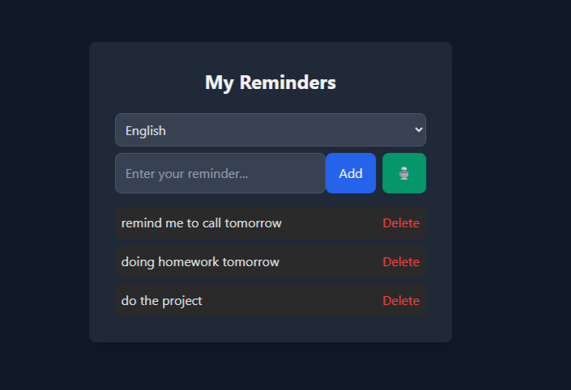

# Voice-reminder

A smart, lightweight voice-powered reminder app built with **HTML**, **TailwindCSS**, and **Vanilla JavaScript**.  
It supports **Speech Recognition**, **multilingual interface (English & Persian)**, and **localStorage** for saving reminders permanently in your browser.

---

## 📸 Demo Preview

> 🔗 [Live Demo](voice-reminder.netlify.app)  
> 🔗 [GitHub Repo](https://github.com/your-username/your-repo)

## 🚀 Features

- 🎤 **Voice input** using the Web Speech API
- 🌐 **Multi-language support**: English and Persian
- 🗃️ **Persistent reminders** using `localStorage`
- 🌓 **Dark theme UI** designed with TailwindCSS
- ⌨️ Add reminders by typing or speaking
- 🗑️ Delete reminders easily

## 📦 Technologies Used

- **HTML5**
- **CSS3 / TailwindCSS**
- **JavaScript (ES6)**
- **Web Speech API**
- **LocalStorage**

## 🌍 Language Support

| Language | Code  |
|----------|-------|
| English  | `en`  |
| Persian  | `fa`  |

You can switch languages with the dropdown menu at the top.

## 🧠 How It Works

1. Choose your language from the dropdown.
2. Type or speak your reminder (click the 🎙️ icon).
3. Click "Add" — your reminder is saved and shown below.
4. All reminders are stored locally in your browser.
5. You can delete any reminder by clicking the delete button.

